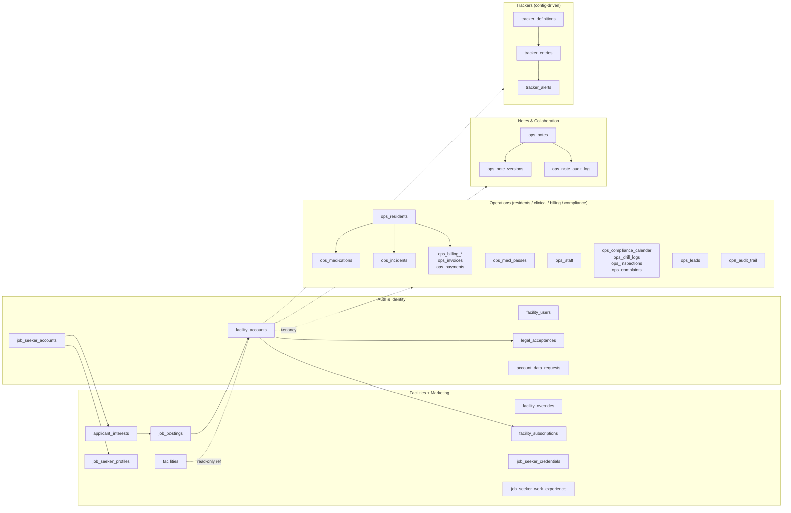
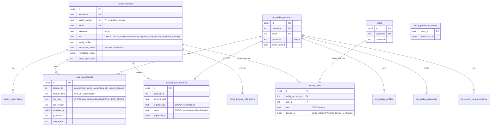
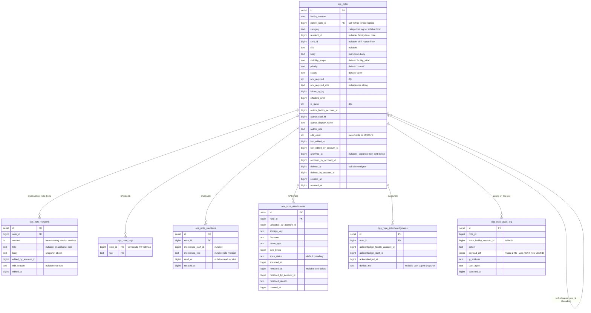
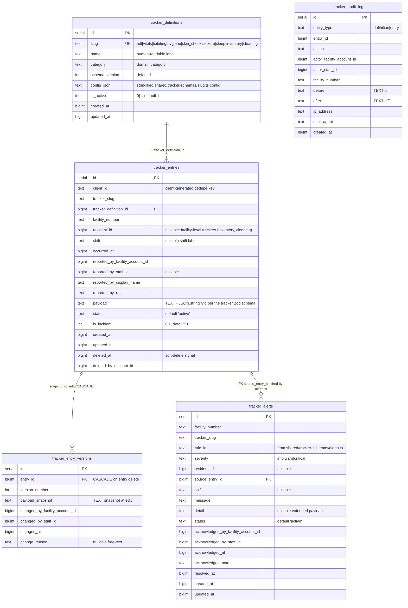

# Database ERD

**Phase 10 — cleanup + docs.** Entity-relationship diagrams for the
arf-map Postgres schema, grouped by domain. The full schema is ~68
tables across 4 Drizzle files; rendering them all in one diagram is
unreadable, so this document splits them into 5 domain clusters
(Auth, Facilities + Marketing, Operations, Notes, Trackers).

Diagrams use [Mermaid `erDiagram`](https://mermaid.js.org/syntax/entityRelationshipDiagram.html)
syntax which renders natively in GitHub, GitLab, and most markdown
viewers. PK columns are marked `PK`, FK columns are marked `FK`,
composite tenant-isolation references (e.g. `(id, facility_number)`)
are notated `FK,FK_tenant`.

**Source of truth.** The Drizzle table definitions in:

- [`shared/schema.ts`](../../shared/schema.ts) — auth, facilities, marketing/jobs, billing, legal (16 tables)
- [`server/ops/opsSchema.ts`](../../server/ops/opsSchema.ts) — operations (40 tables)
- [`server/ops/notesSchema.ts`](../../server/ops/notesSchema.ts) — notes/collaboration (7 tables)
- [`server/trackers/trackerSchema.ts`](../../server/trackers/trackerSchema.ts) — config-driven trackers (5 tables)

If a diagram drifts from those files, the diagram is wrong. Update
the diagram during the same PR that changes the schema.

---

## High-level domain map



> **Tenancy invariant.** Every operations / notes / tracker row is
> scoped by `facility_number`. The DB enforces this via composite FK
> `(id, facility_number)` against a `UNIQUE (id, facility_number)`
> constraint on the parent — see CLAUDE.md "Schema invariants
> (Phase 2)" for the full list of parent tables that carry the
> composite UNIQUE.

---

## Domain 1 — Auth & Identity

Three account types coexist; their lifecycles, sessions, and 2FA
posture are independent.



**Key relationships:**

- `facility_accounts.facility_number` references `facilities.number`. Since `facilities` is a read-only ETL destination, the FK is not enforced — see the Facilities domain below.
- `legal_acceptances.account_id` is polymorphic: the row's `account_kind` ("facility" or "seeker") tells which table the id is in. There's no DB-level FK because of the polymorphism; integrity is enforced in `server/lib/legal.ts:recordAcceptance()`.
- `facility_users` is **schema seam only** — wired for a future multi-staff phase, no rows in production yet (see CLAUDE.md "Schema invariants — Phase 3 audit columns + membership table").
- `users` table predates the auth split; effectively unused but retained for the membership-table foreign key.

---

## Domain 2 — Facilities + Marketing (jobs + applicants)

```mermaid
erDiagram
  facilities ||--o| facility_overrides : "1:1 by facility_number"
  facilities ||--o{ facility_accounts : "1:N owner accounts"
  facilities ||--o{ job_postings : "via facility_number"
  job_postings ||--o{ applicant_interests : "FK job_id"
  job_seeker_accounts ||--o{ applicant_interests : "FK job_seeker_id"
  facility_accounts ||--o| facility_subscriptions : "1:1 Stripe link"

  facilities {
    text number PK "CCLD facility number"
    text name
    text facility_type "default '' - RCFE|ARF|GH|FFA|FFH"
    text facility_group "default '' - Adult & Senior Care|..."
    text status "ACTIVE|CLOSED|..."
    text address "nullable"
    text city "nullable"
    text county "nullable"
    text zip "nullable"
    text phone "nullable"
    text licensee "nullable"
    text administrator "nullable"
    int capacity "default 0"
    text first_license_date "TEXT - source format from CCLD, not bigint"
    text closed_date "TEXT"
    text last_inspection_date "TEXT"
    int total_visits "default 0"
    int total_type_b "default 0 - Type B citation count"
    int citations "default 0"
    double lat
    double lng
    text geocode_quality
    bigint updated_at "set by ETL"
    bigint enriched_at "set by nightly enrichment job"
  }

  facility_overrides {
    serial id PK
    text facility_number UK FK
    text phone
    text description
    text website
    text email
    text logo_storage_uri "nullable - storage backend URI"
    text logo_mime_type
    bigint logo_updated_at
    jsonb hours_of_operation_json
    jsonb languages_spoken_json
    jsonb care_types_offered_json
    jsonb accreditations_json
    jsonb prefilled_fields "history of CCLD-prefilled vs human-edited fields"
    bigint updated_at
  }

  job_postings {
    serial id PK
    text external_id UK "nanoid(12) - URL-exposed (Phase 7)"
    text facility_number "soft FK by name only; no DB constraint (ETL races)"
    text title
    text type "Caregiver|DSP|Med Tech|..."
    text salary "free-text; parsed by services/payParser.ts"
    text description
    jsonb requirements "string[] default '[]'::jsonb (Phase 2 R2)"
    bigint posted_at
  }

  applicant_interests {
    serial id PK
    text external_id UK "nanoid(12) - URL-exposed (Phase 7)"
    int job_seeker_id "soft FK to job_seeker_accounts.id"
    int job_id "nullable - soft FK to job_postings.id (no DB constraint); when null = facility-level interest"
    text facility_number
    text role_interest
    text message
    text status "default 'pending'; viewed|shortlisted"
    bigint created_at
    bigint updated_at
  }

  job_seeker_profiles {
    serial id PK
    int account_id FK UK
    text first_name
    text last_name
    text city
    text state
    int years_experience
    jsonb job_types "string[] - Phase 2 R2 JSONB"
    text bio
  }

  job_seeker_credentials {
    serial id PK
    int account_id FK
    text credential_type
    text issuing_state
    text license_number
    bigint expires_at
  }

  job_seeker_work_experience {
    serial id PK
    int account_id FK
    text employer
    text role
    bigint start_date
    bigint end_date
  }

  facility_subscriptions {
    serial id PK
    int facility_account_id FK UK
    text stripe_customer_id
    text stripe_subscription_id
    text status "active|trialing|past_due|canceled|..."
    bigint current_period_end
  }
```

**Key relationships:**

- `facilities` is the ETL destination from CHHS open data. Other tables reference `facility_number` (text PK), but FKs to `facilities` are NOT enforced because the ETL can delete + re-insert rows during a refresh window.
- `job_postings.external_id` + `applicant_interests.external_id` are nanoid(12) strings exposed in URLs — see CLAUDE.md "URL-exposed identifiers (Phase 7)". The internal integer `id` is FK-only.
- `applicant_interests.job_id` is nullable so a job seeker can express interest in a *facility* without targeting a specific posting.
- `facility_subscriptions` is the Stripe link; the Phase 5 `billing_bypass_redemptions` table records lifetime-bypass code redemptions (audit + single-use enforcement).

---

## Domain 3 — Operations (clinical + billing + compliance)

The largest domain. Every table here is tenant-scoped by
`facility_number`; many tables reference `ops_residents(id,
facility_number)` via composite FK to enforce tenant isolation at
the DB level (a child in facility A cannot point at a parent in
facility B).

```mermaid
erDiagram
  ops_residents ||--o{ ops_medications : "composite FK (resident_id, facility_number)"
  ops_residents ||--o{ ops_incidents : "composite FK"
  ops_residents ||--o{ ops_care_plans : "composite FK"
  ops_residents ||--o{ ops_admissions : "composite FK"
  ops_residents ||--o{ ops_billing_charges : "composite FK"
  ops_residents ||--o{ ops_invoices : "composite FK"
  ops_residents ||--o{ ops_resident_trust_accounts : "1:1 composite FK"
  ops_residents ||--o{ ops_resident_assessments : "composite FK"
  ops_medications ||--o{ ops_med_passes : "composite FK"
  ops_medications ||--o{ ops_controlled_sub_counts : "composite FK"
  ops_medications ||--o{ ops_med_destruction : "composite FK"
  ops_invoices ||--o{ ops_payments : "composite FK"
  ops_invoices ||--o{ ops_billing_charges : "via invoice_id"
  ops_resident_trust_accounts ||--o{ ops_resident_trust_ledger : "composite FK"
  ops_resident_trust_accounts ||--o{ ops_resident_trust_statements : "composite FK"
  ops_inspections ||--o{ ops_inspection_citations : "composite FK"
  ops_complaints ||--o{ ops_complaint_investigation_notes : "CASCADE delete"
  ops_staff ||--o{ ops_staff_credentials : "composite FK"
  ops_staff ||--o{ ops_shifts : "composite FK"
  ops_leads ||--o{ ops_tours : "composite FK"
  ops_temperature_fixtures ||--o{ ops_temperature_logs : "composite FK"

  ops_residents {
    serial id PK
    text facility_number "composite UNIQUE (id, facility_number)"
    text external_id "deferred to future phase"
    text first_name
    text last_name
    text status "active|discharged|deceased"
    bigint admission_date
    bigint discharge_date
    bigint created_at
    bigint updated_at
    text created_by
    text updated_by
  }

  ops_medications {
    serial id PK
    text facility_number
    int resident_id FK
    text drug_name
    text dosage
    text frequency
    bool is_controlled "Schedule II-V triggers extra count workflow"
    text status "active|discontinued"
  }

  ops_med_passes {
    serial id PK
    bigint medication_id
    bigint resident_id
    text facility_number
    bigint scheduled_datetime
    bigint administered_datetime "nullable - null while pending"
    text administered_by "free-text staff name at administration"
    text witness_by "nullable - required for controlled subs"
    int right_resident "0|1 - five-rights checklist"
    int right_medication "0|1"
    int right_dose "0|1"
    int right_route "0|1"
    int right_time "0|1"
    int right_reason "0|1"
    int right_documentation "0|1"
    int right_to_refuse "0|1"
    text status "default 'pending'; given|late|missed|refused|held"
    text refusal_reason
    text hold_reason
    text notes
    text pre_vitals_bp "TEXT - blood pressure as 'sys/dia'"
    int pre_vitals_pulse
    double pre_vitals_temp
    int pre_vitals_spo2
    text prn_reason
    bigint prn_effectiveness_noted_at
    text prn_effectiveness_notes
    bigint created_at
    bigint updated_at
    text created_by
    text updated_by
  }

  ops_invoices {
    serial id PK
    text facility_number
    bigint resident_id
    text invoice_number UK
    bigint billing_period_start
    bigint billing_period_end
    bigint subtotal "BIGINT cents, default 0"
    bigint tax "BIGINT cents, default 0"
    bigint total "BIGINT cents, default 0"
    bigint amount_paid "BIGINT cents, default 0"
    bigint balance_due "BIGINT cents, default 0"
    text status "default 'draft'; open|paid|void"
    bigint due_date "nullable"
    bigint sent_at "nullable"
    bigint paid_at "nullable"
    text payment_method "nullable - set at first payment"
    text payment_reference "nullable"
    text notes
    bigint created_at
    bigint updated_at
    text created_by "default 'system'"
    text updated_by "nullable"
  }

  ops_billing_charges {
    serial id PK
    text facility_number
    int resident_id FK
    int invoice_id FK
    text charge_type "room_board|medication|supplies|..."
    text description
    bigint amount "BIGINT cents"
    double quantity "fractional, not money"
  }

  ops_payments {
    serial id PK
    text facility_number
    int invoice_id FK
    int resident_id FK
    bigint amount "BIGINT cents"
    bigint payment_date
    text payment_method "cash|check|ach|card"
  }

  ops_audit_trail {
    serial id PK
    text facility_number
    text actor_id "user / system identifier"
    text actor_role "snapshotted role at write-time"
    text action "create|update|delete|view"
    text entity_type "residents|medications|invoices|..."
    bigint entity_id
    text before_json "TEXT - intentionally NOT JSONB; see CLAUDE.md Phase 2 R2"
    text after_json "TEXT - same"
    bigint occurred_at
    text created_by "default 'system' - audit attribution"
  }
```



**Key relationships:**

- **`ops_residents` is the clinical hub.** Composite FK `(resident_id, facility_number)` against `ops_residents(id, facility_number)` is enforced on every child clinical/financial table — see CLAUDE.md "Schema invariants (Phase 2)" → "Foreign keys + composite tenant integrity."
- **`ops_audit_trail` is append-only.** Phase 3 added `created_at` + `created_by` but NOT `updated_at` / `updated_by` — corrections live in new rows, never updates.
- **Money is BIGINT cents** in every `ops_invoices`, `ops_billing_charges`, `ops_payments`, `ops_resident_trust_*` column. Wire format is dollars; conversion at the route boundary via [server/lib/money.ts](../../server/lib/money.ts).
- **JSONB everywhere it used to be TEXT-as-JSON** — `ops_inspections.findings_json`, `ops_preaudit_pulls.sections_json`, `ops_resident_assessments.raw_json`, `ops_drill_logs.{participants,residents_involved,corrective_actions}_json`, `ops_notification_log.triage_snapshot`. The Phase 2 R2 wire-compat shim re-stringifies on outbound for FE consumers.
- **Soft-delete patterns** vary by table (see CLAUDE.md "Soft-delete policy"): some use `deleted_at BIGINT`, some flip `status` to `'deleted'`/`'discharged'`/`'archived'`. One known violation: `ops_billing_charges` hard-deletes (deferred fix flagged in CLAUDE.md).
- **Tables not shown** (compliance + leads + misc): `ops_compliance_calendar`, `ops_drill_logs`, `ops_complaints`, `ops_inspections`, `ops_leads`, `ops_tours`, `ops_obligations`, `ops_vendors`, `ops_posting_catalog`, `ops_posting_verifications`, `ops_evidence_attachments`, `ops_reports`, `ops_notification_log`, `ops_daily_tasks`, `ops_facility_settings`, `ops_temperature_fixtures`, `ops_temperature_logs`, `ops_share_links`, `ops_preaudit_pulls`. Each one ties back to `facility_number`; see [`server/ops/opsSchema.ts`](../../server/ops/opsSchema.ts) for the full definitions.

---

## Domain 4 — Notes & Collaboration



**Key relationships:**

- **`ops_notes` is the parent for the entire collaboration subtree.** The five child tables (versions, tags, mentions, attachments, acknowledgments) all CASCADE on note delete — OK because they're explicit collections, not financial/clinical data. See CLAUDE.md "Schema invariants (Phase 2)" → "ON DELETE CASCADE only for explicit child collections."
- **`ops_notes.parent_note_id`** is a self-FK used for thread replies (one parent → many children, each a reply).
- **`ops_note_versions`** is append-only. Every edit writes a new row; the latest copy of the title/body lives on `ops_notes`. Reconstruction uses the highest `version` number.
- **`ops_notes.status`** default is `'open'`. Archiving sets `archived_at` (separate column) — status itself is the editorial state, not a delete signal.
- **`ops_note_tags` has a composite PK `(note_id, tag)`** — no surrogate id. Means a note cannot carry the same tag twice.
- **`ops_note_audit_log.payload_diff` is JSONB** (flipped from TEXT in Phase 2 R2). The wire-compat shim does NOT re-stringify it because no FE consumer parses this column today.

---

## Domain 5 — Trackers (config-driven)

The tracker system is the youngest cluster and the only one designed
to be extended via registry entries rather than DB migrations. Adding
a new tracker (Phase 9.5 of the original product roadmap, not this
phase) means a new file in `shared/tracker-schemas/<slug>.ts` and a
registry entry — no new tables.



**Key relationships:**

- **`tracker_definitions`** is seeded by `bootstrapTrackersSchema()` from the registry in [`shared/tracker-schemas/index.ts`](../../shared/tracker-schemas/index.ts). Updates to the TS registry are reflected at server boot.
- **`tracker_entries.payload` is TEXT, not JSONB.** This is the one place in the codebase where a JSON document survived as `TEXT` through the Phase 2 R2 JSONB pass — see CLAUDE.md "Schema invariants (Phase 2)" for the JSONB-conversion list (tracker payload is not on it). Validation against the per-tracker Zod schema happens at the route boundary, not at the DB.
- **`tracker_alerts.source_entry_id`** points back at the entry that fired the alert. Alerts are evaluated by `shared/tracker-schemas/alerts.ts` on every entry insert/update. Phase 1 supports `payload-matches` rules only — cross-entry rules (cluster detection, missing-for-N-days) are deferred.
- **`tracker_entry_versions`** is append-only with `ON DELETE CASCADE` from `tracker_entries`. If a tracker entry is hard-deleted, its history goes too — but the standard flow is soft-delete via `deleted_at`, which preserves history.

---

## Cross-domain notes

- **Facility tenancy** is the universal partitioning key. Every operations + notes + tracker query MUST include `facility_number` in its WHERE — both for correctness (the IDOR guard at `opsRouter.param("facilityNumber")` checks the URL param matches the session) and for performance (the standard composite indexes are `(facility_number, ...)`).
- **External IDs (Phase 7)** are on `job_postings` and `applicant_interests` only. All other URL-addressed tables (50+ paths around `ops_residents` alone) stay on integer PKs for now — see CLAUDE.md "URL-exposed identifiers (Phase 7)" for the deferred-tables list.
- **Session storage** uses one Postgres `session` table managed by `connect-pg-simple`, NOT split by portal. The cookie identity (`arf_facility_sid` vs `arf_seeker_sid`) is what distinguishes facility-owner sessions from job-seeker sessions — see CLAUDE.md "Split session cookies (Phase 1 hardening)."

---

## How to keep this document accurate

- When you add a new table to any of the four schema files, add it to the relevant Mermaid block here in the same PR.
- When you rename or drop a table, update the diagram in the same PR.
- When relationship semantics change (e.g. CASCADE → RESTRICT, or a composite FK is added), update the mermaid edge label.
- This doc is a snapshot, not a generated artifact. Treat it like CLAUDE.md — it gets reviewed.
